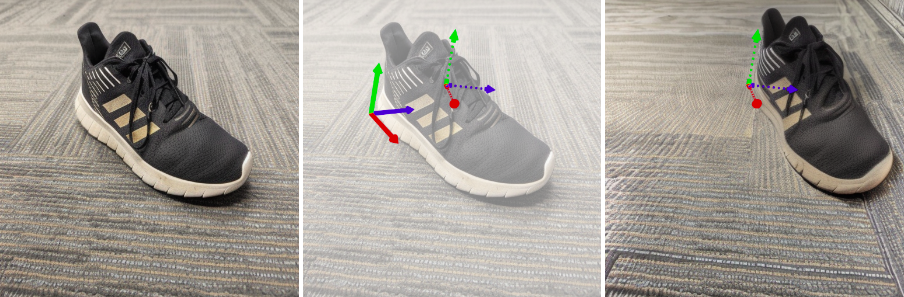
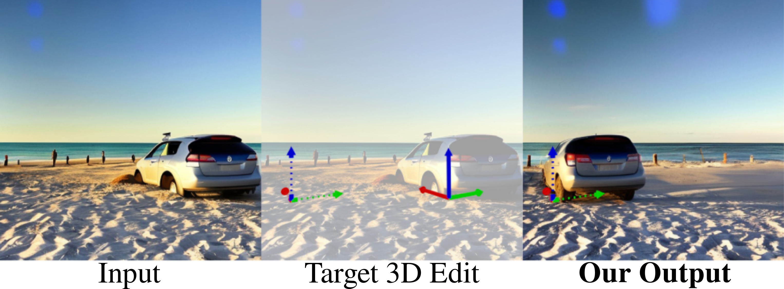
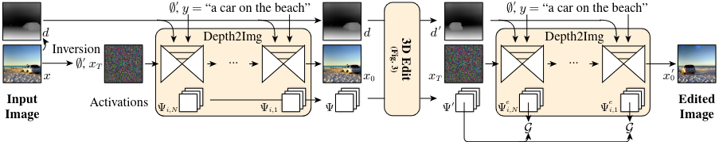
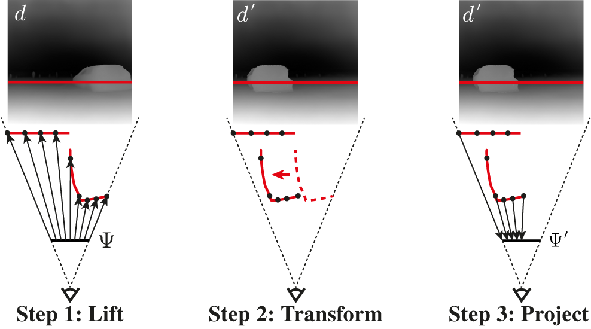

# DiffusionHandles
[[Project Page](https://diffusionhandles.github.io/)][[ArXiv](https://arxiv.org/pdf/2312.02190)]

Diffusion Handles is a **training-free** method that enables **3D-aware image edits** using a **pre-trained Diffusion Model**.


This is the official implementation of the paper\
[**Diffusion Handles: Enabling 3D Edits for Diffusion Models by Lifting Activations to 3D**](https://diffusionhandles.github.io/)\
by [Karran Pandey](https://karranpandey.github.io/), [Paul Guerrero](https://paulguerrero.net/), [Metheus Gadelha](http://mgadelha.me/), [Yannick Hold-Geoffroy](https://yannickhold.com/), [Karan Singh](https://www.dgp.toronto.edu/~karan/), [Niloy J. Mitra](http://www0.cs.ucl.ac.uk/staff/n.mitra/)\
published at [CVPR 2024](https://cvpr.thecvf.com/).

## Examples





## Approach





1. The input image is first reconstructed with a depth-to-image diffusion model. Intermediate activations are recorded.

2. Depth is estimated using a monocular depth estimator and the intermediate activations from the last step are lifted to the 3D depth surface.

3. A user-supplied 3D transform is applied to the depth surface and the lifted activations.

4. The 3D-transformed depth and activations are used to guide the diffusion model to generate an edited image.

## Installation

<!-- ## Install as Package (Experimental)

Install Diffusion Handles as pip package.

```bash
pip install git+https://github.com/Research-Adobe/DiffusionHandles.git
```
TODO: make sure no dependencies are missing -->

Create a [Conda](https://docs.conda.io/en/latest/miniconda.html) environment:
```bash
conda create -n diffusionhandles python=3.9 -y
conda activate diffusionhandles
```
> ### CUDA & PyTorch Installation
>
> If PyTorch and a compatible CUDA runtime are not installed on your system, install PyTorch with conda to make sure you have a CUDA version that works with PyTorch:
> ```bash
> conda install pytorch==2.4.1 torchvision==0.19.1 torchaudio==2.4.1 pytorch-cuda=12.1 -c pytorch -c nvidia
> ```
>
> If a suitable CUDA dev environment including nvcc is not installed on your system, install CUDA dev environment matching the CUDA runtime version:
> ```bash
> conda install cuda-libraries-dev=12.1 cuda-nvcc=12.1 cuda-nvtx=12.1 cuda-cupti=12.1 -c nvidia
> ```

Clone the Diffusion Handles repository:
```bash
git clone https://https://github.com/Research-Adobe/DiffusionHandles.git
cd DiffusionHandles
```

Next, install Diffusion Handles as editable package. Different sets of package dependencies are provided, depending on what you need:
```bash
pip install -e . # Only basic packages required for the 'diffhandles' directory.
```
```bash
pip install -e .[test] # Basic + packages required for the 'test' directory.
```
```bash
pip install -e .[webapp] # Basic + packages required for the 'webapp' directory.
```

## Run Test Scripts

The following will run through the test set and put results in the `results` subdirectory:
```bash
cd test
python test_diffusion_handles.py
```

## Run Web App

Start the full Diffusion Handles Pipeline Web App in [tmux](https://github.com/tmux/tmux/wiki), where `netpath` is the base network path from the root of the server (for example `/demo` for a server at `https://my_server.com/demo`):
```bash
sudo apt install tmux
tmux
cd webapp
source start_webapps_in_tmux.sh <netpath>
```
The main web app should then be reachable at `https://my_server.com/demo/dh`.

The demo consists of multiple services, all of which are started by this script in separate tmux tabs. The main service is in the `diffhandles_pipeline` tab and requires the other services to be running, so the script above starts the main service a few seconds after the others. This is sometimes too short for the other servivces to have finished starting, in that case the main service will fail. You can check by going to the `diffhandles_pipeline` tab in tmux and check if the service is running there. If not, just repeat the last command that was run in that tab after making sure the services in all other tabs are running.

Check `start_webapps_in_tmux.sh` to adjust configuration details like the distribution of ports and GPUs among services.

## Citation
```bibtex
@article{pandey2024diffusionhandles,
  title={Diffusion Handles: Enabling 3D Edits for Diffusion Models by Lifting Activations to 3D},
  author={Pandey, Karran and Guerrero, Paul and Gadelha, Metheus and Hold-Geoffroy, Yannick and Singh, Karan and Mitra, Niloy J.},
  journal={CVPR},
  year={2024}
}
```
